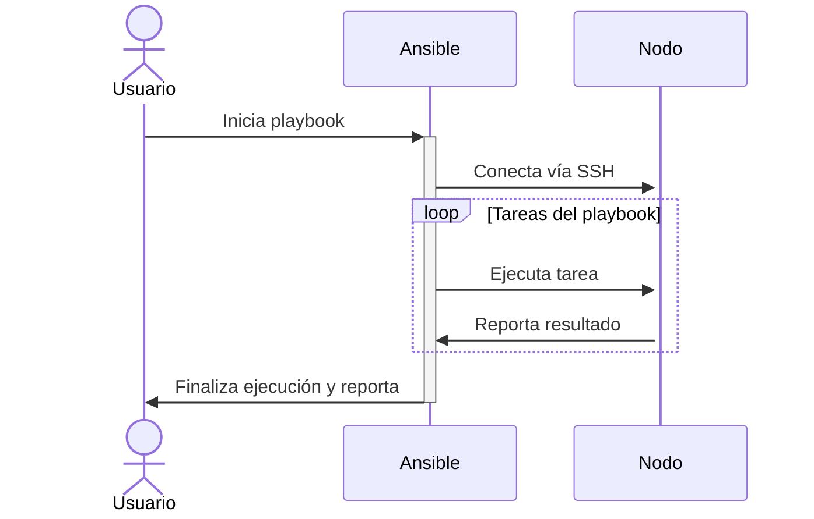

# ¿Qué es Ansible?

Ansible es una herramienta de automatización de TI de código abierto que permite a los ingenieros en sistemas computacionales automatizar la configuración de sistemas, la gestión de despliegues, la orquestación de tareas y muchas otras operaciones de TI. Utiliza YAML (YAML Ain't Markup Language) para escribir descripciones de automatización que son simples, legibles por humanos y que pueden ser ejecutadas por máquinas. Esto hace que Ansible sea accesible para desarrolladores, administradores de sistemas y otros profesionales de TI sin necesidad de conocimientos profundos en scripting o programación.

## Características Principales

- **Idempotencia**: La capacidad de ejecutar una operación varias veces sin cambiar el resultado después de la primera aplicación. Esto asegura la consistencia del estado deseado de los sistemas y aplicaciones gestionadas.
- **Gestión de Configuraciones**: Permite a los usuarios definir y mantener en código las configuraciones de sus sistemas y aplicaciones, facilitando la gestión y replicación de entornos.
- **Orquestación de Tareas**: Ansible puede coordinar acciones complejas entre diferentes sistemas, servicios y herramientas, permitiendo una gestión eficiente de las dependencias y el flujo de trabajo.
- **Automatización sin Agentes**: No requiere la instalación de software adicional ("agentes") en los nodos gestionados. Se conecta y ejecuta tareas utilizando SSH (Secure Shell) o WinRM (Windows Remote Management) para sistemas Windows.

## Ventajas de Ansible 

- **Simplicidad y Facilidad de Uso**: La sintaxis de Ansible es clara y fácil de aprender, lo que permite a los ingenieros automatizar tareas complejas con poco esfuerzo.
- **Escalabilidad**: Ansible puede gestionar desde un pequeño número de nodos hasta miles de ellos, lo que lo hace adecuado para entornos de cualquier tamaño.
- **Versatilidad**: Se puede utilizar para gestionar configuraciones en varios sistemas operativos, desplegar aplicaciones en diversos entornos y orquestar flujos de trabajo de TI complejos.
- **Comunidad y Soporte**: Cuenta con una amplia comunidad de usuarios y desarrolladores que contribuyen constantemente con módulos, plugins y mejoras, lo que enriquece el ecosistema de Ansible.

## Ejemplo Básico en Markdown

Diagrama de Secuencia:



Aquí se muestra un ejemplo básico de cómo definir una tarea en Ansible para actualizar todos los paquetes en un servidor Ubuntu:

```yaml
---
- name: Actualizar todos los paquetes en un servidor Ubuntu
  hosts: servidores_ubuntu
  become: yes
  tasks:
    - name: Actualiza todos los paquetes a la última versión
      apt:
        update_cache: yes
        upgrade: dist
```


## Conclusión

Para los ingenieros en sistemas computacionales, Ansible ofrece una solución poderosa y flexible para la automatización de tareas de TI, gestión de configuraciones y orquestación de despliegues. Su simplicidad, junto con la capacidad de manejar complejas automatizaciones, lo convierte en una herramienta esencial en el arsenal de cualquier profesional de TI.

-----
# django-playbook

Este repositorio contiene un script de Ansible diseñado para configurar automáticamente un entorno de desarrollo Django en una máquina remota. Actualmente, está optimizado para funcionar en sistemas Ubuntu 22.04.

## Características Incluidas:
- **nvim** como editor de código.
- **PostgreSQL** como sistema de gestión de bases de datos.

## Tareas Pendientes:
- Clonación de un repositorio de Django desde GitHub.
- Creación de un entorno virtual y la instalación de las dependencias necesarias.

El script está configurado, por ahora, para ejecutarse en el servidor de desarrollo proporcionado por Django.

## Uso en GitHub Codespaces:

1. **Inicialización**: Abre este repositorio en un Codespace.
2. **Configuración de la Llave SSH**:
   - Sube tu archivo de llave SSH al directorio `ssh-keys`. Para ello, haz clic derecho en el directorio `ssh-keys` en el explorador de archivos y selecciona la opción "Upload...".
   - Cambia los permisos del archivo de llave ejecutando el comando `chmod 400 ssh-keys/tu-llave.pem` en la terminal.
3. **Instalación de Ansible**: Ejecuta `pip install ansible` para instalar Ansible.
4. **Configuración del Host**:
   - Añade la información de tu host y llave SSH al archivo `hosts.yml`.
5. **Ejecución del Playbook**:
   - Para configurar tu entorno, ejecuta el playbook deseado. Por ejemplo, para configurar PostgreSQL, usa el comando `ansible-playbook playbooks/postgres.yml -i hosts.yml`.

Este flujo de trabajo simplifica la configuración inicial de tu entorno de desarrollo Django en una máquina remota, aprovechando las capacidades de automatización de Ansible y la flexibilidad de GitHub Codespaces para un desarrollo más ágil y sin contratiempos.
